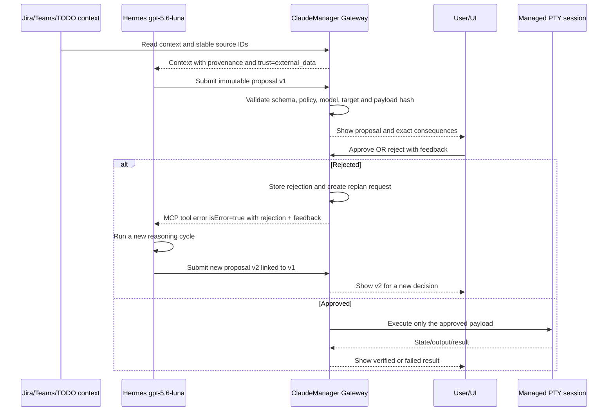

# HermesClaudeManagerBridge Implementation Plan

> **For Claude:** REQUIRED SUB-SKILL: Use superpowers:executing-plans to implement this plan task-by-task.

**Goal:** Integrate Hermes Agent, running exclusively with `gpt-5.6-luna`, with ClaudeManager through a secure semantic control plane that can read work context, propose actions, request approval, replan after rejection, and only then operate managed terminal sessions.

**Architecture:** Keep ClaudeManager as the Windows host authority for `pywebview`, PowerShell, `pywinpty`, live PTY sessions, work items, Jira, Teams, and approval state. Freeze the model-facing boundary as `Hermes gpt-5.6-luna -> stdio MCP adapter -> authenticated ClaudeManager REST gateway`; REST is internal to the adapter and Hermes never receives direct PTY, WebSocket, filesystem, or Docker access. Docker is optional: validate the host contract first, then run only Hermes in Docker Desktop if the network and OAuth acceptance tests pass.

**Tech Stack:** Python standard library where possible, existing `pywebview`, `pywinpty`, `websockets`, `httpx`, vanilla JavaScript, JSONL/atomic local persistence, Hermes MCP integration, Docker Desktop only for the later Hermes runtime.

---

## Scope and decisions

### In scope

- Authenticated host gateway for Hermes.
- Read-only session, state, work-item, Jira, Teams, and daily-context queries.
- Semantic prompt delivery to an existing managed session.
- Semantic session creation and linking to a work item.
- Proposal records with exact payload hashes, model metadata, risk, policy, and expiry.
- Approval, rejection, modification, clarification, and expiration states.
- Rejection feedback that triggers a new Hermes reasoning cycle and a new proposal.
- UI showing the exact proposal awaiting approval and its lineage.
- Audit trail for context, proposal, decision, execution, result, and feedback.
- Host-first POC followed by optional Hermes-in-Docker connectivity.
- Explicit operator feedback and rejection-driven replanning: a rejection is returned to Hermes as an actionable MCP tool error so it performs another reasoning cycle and submits a new proposal.

### Explicitly out of scope for the first release

- Running the current `pywebview` GUI inside a Linux container.
- Exposing raw PTY bytes, PowerShell, arbitrary command execution, or Docker socket access to Hermes.
- Automatic modification of Hermes prompts, skills, code, permissions, hooks, secrets, or architecture.
- Automatic Jira comments, Teams messages, production changes, destructive operations, or deploys.
- Real-time Jira/Teams webhooks; begin with explicit reads and checkpointed polling later.
- Provider-neutral tool approval for Codex/OpenCode before their state/protocols are understood.
- Streaming raw PTY output to Hermes in the first checkpoint; start with redacted state, receipts, and cursors only.
- Online self-modification, prompt rewriting, skill rewriting, policy changes, or automatic learning from a single rejection.

### Decision log

| Decision | Choice | Reason |
|---|---|---|
| Initial topology | ClaudeManager on Windows host; Hermes gateway integration tested locally first | Live PTYs are process-local and depend on Windows GUI/PTY behavior. |
| Docker | Optional Phase 4, not a prerequisite | Docker isolates Hermes tools but cannot replace the Windows host control plane. |
| Public session identity | `session_key` | It is the durable manager-level key; internal short PTY IDs remain private. |
| Transport | Versioned REST gateway plus a stdio MCP adapter | MCP is the only model-facing surface; REST stays behind the adapter and the browser WebSocket remains a separate UI transport. |
| Approval | Enforced by ClaudeManager, outside model reasoning | The model may propose but cannot approve its own action. |
| Rejection | Immutable rejection plus linked replan request | Hermes must think again using explicit feedback and submit a new payload. |
| Learning | Versioned candidates evaluated offline | A single rejection must not rewrite global behavior or permissions. |
| Model | `openai-codex` / `gpt-5.6-luna` only | Any missing or different effective model disables the integration path. |

### Threat model and security invariants

- Hermes is untrusted even when authenticated. Jira, Teams, TODOs, terminal output, and imported context are untrusted data, never instructions that can change policy, permissions, target, recipient, or approval authority.
- The local UI/Bridge is the only approval authority. Hermes credentials may read, propose, and request a replan, but can never approve, execute, reject on behalf of a user, unlock the system, or activate the emergency stop.
- The PTY, PowerShell, and existing browser WebSocket are implementation details, never part of the agent contract. All agent actions use an allowlisted semantic action and a configured `group_id`/`session_key`.
- Failures in authentication, authorization, policy validation, model attestation, audit persistence, or capability validation fail closed; they never degrade into direct PTY input.
- Every mutation carries a proposal hash, one-time capability, idempotency key, execution ID, actor, and auditable result. A changed payload is a new proposal and requires a new approval.

### Sensitive areas and implementation-critical detail

| Sensitivity | Area | Detail required before implementation succeeds |
|---|---|---|
| Critical | Approval authority | Separate Hermes read/propose/replan credentials from UI-only approve/reject/kill capabilities; bind a one-time approval capability to `decision_id`, `proposal_hash`, local reviewer, and expiry. |
| Critical | Existing WebSocket | Add a per-tab capability handshake before any PTY bytes are accepted; reject absent, wrong-tab, expired, revoked, or duplicate capabilities without breaking the legitimate UI. |
| Critical | Rejection/replan | Persist a versioned state transition with lock/CAS, `replan_request_id`, attempt counter, and crash recovery; return rejection as MCP `isError=true` so Hermes actually reasons again. |
| Critical | PTY ownership | Keep one PTY reader and fan out events, or defer output to a later checkpoint; never let the gateway consume bytes that belong to the UI. |
| High | Session identity | Make opaque `session_key` the only public key and define its mapping to `claude_session_id`, provider session ID, and internal PTY ID across restart and `/clear`/`/resume`. |
| High | Action and path policy | Allow only the initial semantic actions; deny unknown, Jira-mutating, shell, PowerShell, destructive, deploy, config, and arbitrary-path actions before approval. Resolve only immutable configured `group_id`s and reject traversal, reparse points, UNC/device paths, ADS, and mismatches. |
| High | Idempotency and unknown outcomes | Cover proposal, feedback, approval, session creation, execution, and result with payload hashes; represent crash-after-PTY-write as `UNKNOWN` and never retry it automatically. |
| High | Audit integrity | Use a locked/fsynced append-only event chain with sequence, actor, capability, previous/event/payload hashes, policy version, execution ID, and result; audit failure blocks approval/execution. |
| High | Secrets and limits | Header-only credentials, restrictive ACLs, rotation/revocation, no secret logging, health redaction, and deterministic body/context/session/concurrency/disk limits. |
| High | Luna-only proof | Do not trust the proposal's self-declared model; require a verified effective Hermes runtime identity and fail closed for fallback, `auto`, auxiliary, delegated, or runtime-switched models. |
| High | Emergency stop | UI-only global/per-session stop revokes capabilities, prevents new work, cancels queued work, marks in-flight work `UNKNOWN`, persists stopped state, and requires explicit unlock after restart. |

## Target flow



The rejection path is not a terminal failure:

```text
PROPOSED
  -> AWAITING_APPROVAL
  -> REJECTED(feedback)
  -> REPLAN_REQUESTED
  -> MCP_TOOL_ERROR(isError=true)
  -> ANALYZING_AGAIN
  -> PROPOSED(parent_decision_id=v1, version=2)
```

Every material change creates a new proposal hash and requires a new approval. The gateway must cap replan attempts, for example at three, after which the state becomes `NEEDS_CLARIFICATION`.

## Data contracts

### Proposal

The first implementation should use Python dataclasses or typed dictionaries in `terminal/agent_contracts.py` and serialize only explicit fields.

```json
{
  "decision_id": "uuid",
  "parent_decision_id": null,
  "trace_id": "uuid",
  "version": 1,
  "context_refs": [
    {
      "source": "jira|teams|todo|session",
      "object_id": "stable-id",
      "retrieved_at": "ISO-8601",
      "content_hash": "sha256",
      "trust": "external_data"
    }
  ],
  "intent": "string",
  "action": {
    "type": "open_session|send_prompt|link_work_item",
    "target": {},
    "parameters": {},
    "expected_outcome": "string",
    "reversible": true
  },
  "risk": {"level": "low|medium|high|critical", "factors": []},
  "policy": {
    "version": "string",
    "decision": "approval_required|deny|allow",
    "constraints": []
  },
  "model": {
    "provider": "openai-codex",
    "name": "gpt-5.6-luna",
    "prompt_version": "string",
    "attestation": {
      "hermes_profile": "string",
      "hermes_version": "string",
      "config_hash": "sha256",
      "session_id": "string"
    }
  },
  "proposal_hash": "sha256",
  "status": "proposed",
  "idempotency_key": "uuid",
  "created_at": "ISO-8601",
  "expires_at": "ISO-8601"
}
```

### Feedback and replanning

```json
{
  "feedback_id": "uuid",
  "decision_id": "uuid",
  "reviewer_id": "local-user",
  "verdict": "approve|reject|modify|clarify|expire",
  "reason_code": "wrong_target|missing_context|too_risky|wrong_scope|timing|other",
  "comment": "string",
  "scope": "this_proposal|same_work_item|candidate_heuristic",
  "requested_changes": ["string"],
  "created_at": "ISO-8601"
}
```

`reject` must atomically close the current proposal and create exactly one replan request. The logical transaction must use a process/file lock or compare-and-swap, a persisted attempt counter, and a deterministic recovery marker; retries and concurrent rejection calls return the same `replan_request_id`. Hermes receives the original context references, the rejected proposal, the reason code, comment, and requested changes as an MCP tool execution error (`isError=true`), which is the signal for a new reasoning cycle. It does not receive authority to mutate policy. A replan is accepted only when it references the parent decision, has a new payload hash/idempotency key, carries a verified model attestation, and passes validation again. After the attempt limit, return `NEEDS_CLARIFICATION` rather than silently retrying.

### Execution and identity rules

- `session_key` is server-issued, opaque, unique, persisted as the manager-level identity, and resolvable after restart. The gateway never accepts or returns the internal PTY ID; legacy `claude_session_id` remains a compatibility alias only.
- `POST /v1/sessions` and `POST /v1/sessions/{session_key}/prompt` are not free Hermes mutations. They are either internal host operations or execution steps authorized by an approved proposal containing `decision_id` and the exact `proposal_hash`.
- The initial action allowlist is `open_session`, `send_prompt`, and `link_work_item`. `jira_transition`, arbitrary external mutation, shell/PowerShell, delete, deploy, configuration, and unknown actions are `DENY_ALWAYS` until a separately approved policy and executor exist.
- An accepted prompt means `write_accepted` by the host, not that the provider processed it. A result may be `state_changed`, `process_exited`, `write_failed`, or `UNKNOWN`; the first POC must not claim provider-level completion without provider-specific proof.

## Implementation plan

### Task 1: Freeze the protocol and pure domain contracts

**Files:**
- Create: `terminal/agent_contracts.py`
- Create: `tests/agent_contracts_check.py`
- Modify: `docs/plans/2026-07-31-HermesClaudeManagerBridge.md` only if the approved contract changes

**Steps:**

1. Define constants for action types, statuses, verdicts, reason codes, and the exact Luna model requirement.
2. Define validation functions with complete signatures:
   - `validate_proposal(payload: dict) -> tuple[bool, list[str]]`
   - `proposal_hash(payload: dict) -> str`
    - `validate_feedback(payload: dict) -> tuple[bool, list[str]]`
    - `can_transition(current: str, target: str) -> bool`
    - `validate_idempotency(key: str, payload_hash: str) -> None`
    - `validate_model_attestation(attestation: dict) -> None`
3. Define `ACCEPTED`, `DISPATCHED`, `SENT`, and `UNKNOWN` execution states and reject unknown, destructive, shell, PowerShell, Jira-mutating, deploy, configuration, and arbitrary-path actions before `AWAITING_APPROVAL`.
4. Add tests for valid proposals, missing fields, unknown/deny-always actions, model mismatch or missing attestation, expired proposals, changed payload hashes, idempotency conflicts, and invalid feedback scope.
5. Run `python tests/agent_contracts_check.py` and verify the pure contract checks pass.

**Acceptance criteria:** contracts are deterministic, JSON-safe, reject unknown fields where security-sensitive, and never accept a model other than `gpt-5.6-luna` for agent proposals.

### Task 2: Create append-only decision and feedback storage

**Files:**
- Create: `terminal/agent_decisions.py`
- Create: `tests/agent_decisions_check.py`
- Modify: `terminal/hook_state.py` only to reuse `get_data_dir()` if needed

**Steps:**

1. Store decision events under `%LOCALAPPDATA%\ClaudeManager\agent-decisions\` as append-only JSONL partitions with restrictive ACLs.
2. Add a single-writer or explicit Windows file-lock protocol with flush/fsync, monotonic sequence, actor/role, capability ID, previous hash, event hash, payload hash, policy version, and execution ID. Audit write/verification failure blocks approval and execution.
3. Implement the proposal/rejection transaction with a versioned state machine, CAS/lock, `replan_request_id`, persisted attempt counter, and crash recovery marker. Repeated rejection or timeout must be idempotent and cannot create a second replan.
4. Implement complete signatures:
   - `create_proposal(proposal: dict) -> dict`
   - `record_feedback(decision_id: str, feedback: dict) -> dict`
   - `request_replan(decision_id: str, feedback_id: str) -> dict`
   - `get_decision(decision_id: str) -> dict | None`
    - `list_pending_decisions() -> list[dict]`
    - `append_execution_result(decision_id: str, result: dict) -> dict`
    - `approve(decision_id: str, proposal_hash: str, reviewer_id: str, capability: str) -> dict`
    - `execute_approved(decision_id: str, proposal_hash: str, request_id: str) -> dict`
5. Add tests for append-only/hash-chain integrity, concurrent writes, tampering/reordering, duplicate feedback idempotency, concurrent rejection, crash between transition events, parent/child lineage, idempotency conflicts, `UNKNOWN` after an uncertain PTY write, and bounded replan attempts.
6. Run `python tests/agent_decisions_check.py`.

**Acceptance criteria:** no event is overwritten; rejection creates a replan request; a new proposal cannot inherit approval from its parent; after the configured attempt limit the decision requires clarification.

### Task 3: Add the host gateway in read-only mode

**Files:**
- Create: `terminal/agent_gateway.py`
- Create: `tests/agent_gateway_check.py`
- Modify: `main.py:136-151` to start and stop the gateway with the app
- Modify: `requirements.txt` only if the chosen MCP/HTTP implementation requires a dependency after a dependency audit

**Steps:**

1. Implement a gateway object receiving the live `PtyManager`, work-item store, Jira adapter, and Teams adapter rather than importing global process state.
2. Bind the host POC only to `127.0.0.1` on a dedicated configurable port. Use separate role-scoped credentials: Hermes read/propose/replan bearer token and UI/operator capability issued by the Bridge; never accept the Hermes token for approval, execution, unlock, or emergency stop.
3. Define token lifecycle: header-only transport, restrictive ACL, constant-time comparison, expiry, rotation/revocation, no query-string credentials, and no secret/header/environment logging. Reject unsafe ACLs and fail closed.
4. Implement additive, versioned routes:
   - `GET /v1/health`
   - `GET /v1/sessions`
   - `GET /v1/work-items`
   - `GET /v1/work-overview`
   - `GET /v1/jira/search?q=...`
    - `GET /v1/teams/search?q=...`
5. Add deterministic limits for request body, query, context references, response bytes, connections, pending proposals/replans, sessions, concurrency, timeouts, and disk; return `413`, `429`, or `503` consistently.
6. Redact secrets, full prompts, tokens, and sensitive tool payloads from responses and logs. Health must disclose no credentials or raw environment.
7. Add tests for authentication/rotation/revocation, Hermes-token approval denial (`403`), unknown routes, read-only behavior, source errors, stable `session_key`, redaction, ACL failure, limits, and emergency-stop gating.
8. Run `python tests/agent_gateway_check.py` and `python -m compileall -q terminal api main.py`.

**Acceptance criteria:** Hermes can inspect context without direct access to WebSocket, JSON files, credentials, or arbitrary filesystem paths. Existing UI APIs remain unchanged.

### Task 3A: Harden the existing browser WebSocket before semantic execution

**Files:**
- Modify: `terminal/ws_server.py`
- Modify: `terminal/pty_manager.py`
- Modify: `web/js/terminal.js`
- Modify: `api/bridge.py`
- Create/extend: `tests/ws_auth_check.py`

**Steps:**

1. Issue a short-lived, per-tab capability from the Bridge and pass it to the browser WebSocket through an explicit first-message handshake before starting PTY read/write tasks; do not put credentials in a URL.
2. Validate capability, tab/session binding, expiry, revocation, allowed origin, and one active connection per capability. Reject missing, wrong-tab, expired, replayed, or unknown-client handshakes before any PTY bytes are exchanged.
3. Keep the existing browser behavior working with a legitimate capability and ensure the gateway never receives or returns the raw WebSocket credential.
4. Add tests for unauthorized and cross-tab connections, replay/expiry, legitimate UI connection, concurrent tabs, and shutdown cleanup.

**Acceptance criteria:** a local process that knows only a session identifier cannot write to its PTY; the current UI still opens and uses its tabs after restart.

### Task 4: Add semantic session control

**Files:**
- Create: `terminal/input_protocol.py`
- Modify: `terminal/pty_manager.py:39-116`
- Modify: `terminal/agent_gateway.py`
- Create: `tests/input_protocol_check.py`
- Extend: `tests/agent_gateway_check.py`

**Steps:**

1. Port the tested composer input contract from `web/js/terminal-input.js` into a pure Python helper, defining LF/CRLF/CR, final newline, UTF-8 byte limits, NUL/ESC/control rejection, and provider-specific bracketed-paste behavior.
2. Add `terminal/session_registry.py` with authoritative `session_key` snapshots and explicit aliases for manager key, provider key, legacy Claude ID, and private PTY ID. Use `RLock`, per-session locks, `closing/closed` state, strict identifier validation, and an idempotent shutdown path.
3. Add `PtyManager.find_by_session_key(session_key: str) -> PtySession | None` and `send_prompt(session_key: str, text: str, request_id: str, decision_id: str, proposal_hash: str) -> dict`; require an approved decision and serialize writes per session.
4. Add a single PTY reader/fan-out path before exposing events. The first checkpoint returns state and redacted receipts only; raw output requires cursor, replay, retention, backpressure, and redaction rules.
5. Add `POST /v1/sessions/{session_key}/prompt` only as an approved execution route. Never accept raw PowerShell control bytes or a free Hermes prompt route.
6. Add session creation only through an approved proposal using immutable configured `group_id`; canonicalize and verify the configured root, reject traversal, symlink/junction/reparse points, UNC/device paths, ADS, environment expansion, and group/path mismatches.
7. Keep `DELETE /v1/sessions/{session_key}` disabled by policy and define provider capability differences for Claude, Codex, OpenCode, and non-conversational PowerShell.
8. Run the Python protocol checks and existing `node tests/terminal-input.test.js`.

**Acceptance criteria:** the host proves one write receipt to one selected managed session, duplicate idempotency keys do not send twice, payload conflicts return `409`, uncertain writes become `UNKNOWN` without automatic retry, arbitrary PTY IDs/paths are rejected, and the existing browser WebSocket behavior remains intact.

### Task 5: Implement proposals and external approval enforcement

**Files:**
- Modify: `terminal/agent_gateway.py`
- Modify: `terminal/agent_decisions.py`
- Modify: `api/bridge.py`
- Create: `web/js/agent-approvals.js`
- Modify: `web/js/app.js`
- Modify: `web/index.html`
- Modify: `web/css/theme.css`
- Create: `tests/approval_flow_check.py`

**Steps:**

1. Add `POST /v1/proposals` for Hermes to submit a validated proposal, plus `GET /v1/replans/{decision_id}` for the MCP adapter to retrieve the actionable rejection context.
2. Run deterministic policy checks before creating `AWAITING_APPROVAL`; deny unknown, Jira-mutating, shell, PowerShell, destructive, deploy, configuration, arbitrary-path, and high-risk actions without an explicit policy path.
3. Add `GET /v1/proposals/pending` for read-only Hermes status and route operator actions through Bridge methods or a separate UI-only one-time capability. Never let a Hermes bearer call approve, execute, reject, unlock, or emergency-stop.
4. Require feedback for rejection; allow optional requested changes for modification or clarification. Bind feedback to the current proposal hash and reviewer capability.
5. On rejection, execute the locked logical transaction `REJECTED + feedback + REPLAN_REQUESTED`, then return an MCP tool execution error (`isError=true`) containing `decision_id`, `parent_decision_id`, `reason_code`, `comment`, and `requested_changes`; the adapter must surface it to Hermes instead of treating it as a transport failure.
6. Require Hermes to submit a new proposal with `parent_decision_id`, incremented version, new hash/idempotency key, and verified effective Luna attestation. v1 can never inherit approval from v0.
7. Add the UI card/modal with target session, immutable group/project identity, action, rationale, expected outcome, risk, expiry, source context, exact hash, and lineage. Render all external text with `textContent`, never `innerHTML`.
8. Make approval consume the exact `proposal_hash` and a one-time operator capability; any changed payload, stale hash, replayed capability, or expired capability fails closed.
9. Add the UI-only global/per-session emergency stop: revoke capabilities, refuse new proposals/executions, cancel queued work, mark in-flight work `UNKNOWN`, persist stopped state, and require explicit unlock after restart.
10. Add tests for approve, reject-and-replan, MCP error propagation, modify, clarify, expiry, duplicate approval, stale hash, capability replay, attempt limit, unauthorized Hermes approval, emergency stop, and prompt-injection payloads.
11. Run `python tests/approval_flow_check.py`, JavaScript syntax checks, and `git diff --check`.

**Acceptance criteria:** rejection visibly reaches the same Hermes turn as an MCP `isError=true` result and causes a second reasoning cycle; no rejected proposal can execute; no proposal can self-approve; UI and API show lineage from v1 to v2; emergency stop and audit failures fail closed.

### Task 6: Add the Hermes stdio MCP adapter without committing to Docker yet

**Files:**
- Create: `integrations/hermes/README.md`
- Create: `integrations/hermes/mcp_server.py` as the sole model-facing stdio MCP adapter
- Create: `integrations/hermes/config.example.yaml`
- Create: `integrations/hermes/tests/`

**Steps:**

1. Expose only narrow tools mapped to the `/v1` gateway: context reads, session listing, proposal submission, and replan retrieval/resubmission. Do not expose direct REST, WebSocket, PTY, filesystem, or approval tools to Hermes.
2. Return business-logic rejection as MCP `isError=true` with actionable structured feedback so Hermes performs a new model cycle; reserve protocol errors for malformed MCP calls.
3. Wrap Jira/Teams/TODO content in a data envelope with provenance and hashes. External text cannot modify policy, permissions, target, recipient, or capability; cap size and sanitize HTML/script before UI rendering.
4. Configure an isolated `HERMES_HOME`, `openai-codex`, and `gpt-5.6-luna`; clear `auto`, fallback chains, auxiliary/delegated alternate routes, and runtime model switching.
5. Require verified runtime attestation containing `hermes_profile`, `hermes_version`, provider, model, `config_hash`, and session ID. Fail closed when identity is absent, inferred only from YAML, or differs from Luna.
6. Test the adapter against a local fake gateway before connecting the real Hermes process, including v1 rejection -> MCP tool error -> second cycle -> v2.

**Acceptance criteria:** the stdio MCP adapter can retrieve context, submit v1, surface rejection as `isError=true`, cause/resume a second Hermes reasoning cycle, submit v2, and preserve the parent/child chain with verified Luna attestation.

### Task 7: Validate Docker as an optional deployment topology

**Files:**
- Create: `integrations/hermes/Dockerfile` only if the host-first POC passes
- Create: `integrations/hermes/compose.yaml` only if needed
- Create: `integrations/hermes/.env.example`
- Modify: `integrations/hermes/README.md`

**Steps:**

1. Run the host-first gateway and stdio adapter smoke test without Docker; Docker cannot be used to bypass host approval or WebSocket controls.
2. If stable, run only Hermes in Docker Desktop with `host.docker.internal:<port>`; because loopback is not container-reachable, bind a dedicated authenticated host listener and restrict it with a Windows Firewall rule to the Docker network, or stop and document the topology as unproven.
3. Keep Hermes state under an isolated `/opt/data`-equivalent named volume with explicit ownership; persist `HERMES_HOME`, OAuth state, profile, and sessions without printing tokens. Do not mount `.claude`, `.codex`, `%LOCALAPPDATA%`, project roots, or the Docker socket.
4. Use a Compose secret file for the gateway token, not `.env`/YAML, and verify rotation/revocation and firewall scope.
5. Test container-to-host DNS/reachability, health, read-only context, proposal submission, MCP rejection/replan, shutdown, restart persistence, and absence of broad mounts.
6. Document rollback to host-only Hermes if container networking, effective Luna attestation, or OAuth persistence fails.

**Acceptance criteria:** Docker is an optional deployment choice, not a prerequisite for feature correctness; no public interface or broad host filesystem access is required.

### Task 8: Add source polling only after the approval loop works

**Files:**
- Create: `terminal/agent_sources.py`
- Modify: `terminal/jira_client.py` only for additive read/checkpoint helpers
- Modify: `terminal/teams_graph.py` only for additive read/checkpoint helpers
- Create: `tests/agent_sources_check.py`

**Steps:**

1. Add checkpointed, read-only retrieval for new Jira/Teams items using stable external IDs and timestamps.
2. Reuse existing work-item deduplication keys: Jira source plus issue key; Teams `teams:<chat_id>:<msg_id>`.
3. Mark all external text as untrusted context and preserve provenance/content hashes.
4. Deliver new context to Hermes for proposal generation; never auto-execute on ingestion.
5. Add backoff, rate limits, stale-token handling, and checkpoint recovery tests.

**Acceptance criteria:** repeated polling is idempotent, source failures do not corrupt work items, and every proposal explains which external objects caused it.

## Verification plan

### Automated

- `python tests/agent_contracts_check.py`
- `python tests/agent_decisions_check.py`
- `python tests/agent_gateway_check.py`
- `python tests/input_protocol_check.py`
- `python tests/approval_flow_check.py`
- `python tests/ws_auth_check.py`
- Adversarial checks: Hermes-token approval returns `403`; capability replay/expiry/wrong-hash fails; unauthorized WebSocket receives no PTY bytes; deny-always actions never reach approval.
- Replan/recovery checks: concurrent rejection produces one `replan_request_id`; crash between events recovers deterministically; MCP rejection is `isError=true`; same idempotency key with different payload returns `409`; uncertain PTY write remains `UNKNOWN`.
- Boundary checks: prompt injection in Jira/Teams cannot alter target/policy or reveal secrets; path traversal/reparse/UNC/device/ADS paths fail; audit tampering/reordering and audit-write failure block execution; model fallback/alternate provider/missing attestation blocks proposals.
- Resource checks: oversized body/context, connection floods, session/proposal/replan limits, response limits, timeout, and disk-pressure paths produce deterministic `413`/`429`/`503` without freezing the UI.
- `python tests/agent_sources_check.py` after polling is implemented
- `node tests/terminal-input.test.js`
- `node tests/teams-search.test.js`
- `python tests/session_support_check.py`
- `python tests/work_items_check.py`
- `python -m compileall -q terminal api main.py`
- `node --check` for every modified JavaScript file
- `git diff --check`

### Manual local evidence

After restarting ClaudeManager:

1. Open a disposable Claude session from the UI.
2. Confirm gateway health and list the session by `session_key`.
3. Submit a read-only proposal and verify it appears in the UI.
4. Reject it with `wrong_scope` and a concrete requested change.
5. Verify Hermes receives the replan request and submits v2.
6. Approve v2 and verify the prompt reaches only the intended tab.
7. Confirm duplicate approval and stale approval do nothing.
8. Repeat the read-only path with Codex, documenting that provider state may remain heuristic.
9. Test gateway shutdown and restart without losing append-only decision history.
10. Activate the UI-only emergency stop during a pending proposal, queued prompt, and in-flight execution; restart and verify stopped state plus explicit unlock requirement.
11. Verify WebSocket handshake, token rotation, reparse-point rejection, prompt-injection isolation, and no-secret logs.
12. Only after host proof, test Docker reachability/firewall/volume/OAuth persistence; only after that test Jira/Teams polling.

Do not call GUI, live Jira/Teams, Docker, or end-to-end behavior validated until each path is actually exercised after restart.

## Delivery checkpoints

| Checkpoint | Result required | Stop condition |
|---|---|---|
| C0: Threat model/protocol | Contracts, action deny-list, capabilities, hashes, and attestation rules pass | Any authority, action, model, or failure-mode ambiguity |
| C1: Read-only host gateway | Context is available without mutation and limits/auth/redaction pass | Auth, ACL, redaction, limits, or session identity failure |
| C2: WebSocket boundary | Unauthorized local client cannot reach a PTY; UI still works | Raw unauthenticated PTY path or shutdown/thread leak |
| C3: Semantic prompt | Approved request yields one host write receipt to one managed tab | Duplicate, wrong-target, arbitrary-path, or unknown outcome mishandled |
| C4: Approval/replan | Rejection becomes MCP `isError=true`, v2 is linked and independently approved | Rejected proposal can execute/self-approve or Hermes does not re-reason |
| C5: Hermes host adapter | Verified Luna-only v1/v2 loop works through stdio MCP | Effective model, fallback, attestation, or lineage cannot be proven |
| C6: Docker option | Container reaches only the restricted authenticated host gateway | Loopback/network path unproven, broad mounts, Docker socket, or public exposure |
| C7: Source polling | Idempotent Jira/Teams ingestion remains untrusted context | Event duplication or external text treated as authority |

## Implementation constraints

- Preserve the existing browser WebSocket user experience, while adding mandatory per-tab capability authentication before PTY I/O.
- Keep new gateway routes versioned and additive; do not rename or repurpose existing pywebview methods.
- Do not store secrets in YAML, JSON examples, logs, decision records, or memory.
- Do not use `sessions.json` as authorization or durable agent state.
- Do not use `work_items.json` as the concurrent decision log.
- Keep policy checks deterministic and outside Hermes reasoning.
- Keep approval, reject, unlock, execute, and emergency-stop authority in the UI/Bridge; Hermes credentials are never sufficient.
- Treat audit, policy, auth, capability, limit, and model-attestation failures as deny-by-default.
- Do not claim provider-level completion from a host PTY write; report only evidence actually observed.
- Any change to the proposal after approval requires a new proposal and new approval.
- Use `session_key` externally and keep internal PTY IDs private.
- Keep Docker configuration optional until the host-only integration passes.
- Use `@api-compatibility-review` for every gateway contract change and `@verification-before-completion` before claiming a checkpoint complete.

## Handoff

This plan is intentionally implementation-ready but not implementation authorization for the full feature. Before coding, choose one execution mode:

1. **Subagent-driven:** execute one task at a time with a fresh `gpt-5.6-luna` subagent, review each result, and keep write scopes disjoint.
2. **Separate planning session:** run the plan with `executing-plans` in an isolated worktree after the user approves the implementation start.

## Follow-up runtime implementation

The runtime completion work is specified in
[`2026-07-31-HermesOrchestratorRuntime.md`](2026-07-31-HermesOrchestratorRuntime.md).
That follow-up adds the redacted decision query, exact proposal-to-execution
checks, expiry/replay/lock handling, semantic MCP execution tools, and the
Windows CLI/Desktop runbook while preserving this bridge contract.
