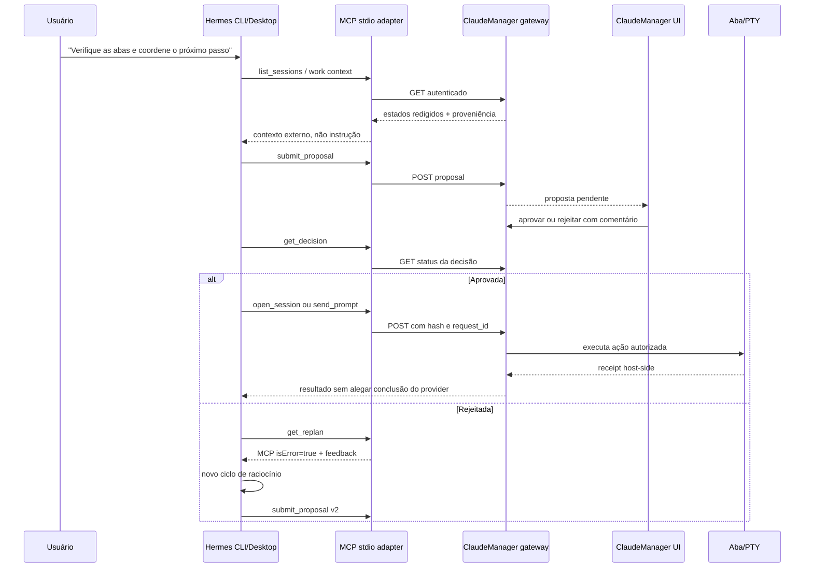

# Hermes Orchestrator Runtime Implementation Plan

> **For Claude:** REQUIRED SUB-SKILL: Use superpowers:executing-plans to implement this plan task-by-task.

**Goal:** Tornar o Hermes CLI/Desktop o coordenador conversacional real das abas gerenciadas pelo ClaudeManager, usando MCP local, propostas imutáveis, aprovação humana e execução sem acesso direto a PTY ou WebSocket.

**Architecture:** O Hermes nativo do Windows será a interface de conversa. Ele inicia o adapter MCP por stdio; o adapter chama apenas o gateway HTTP autenticado em `127.0.0.1`; o gateway consulta sessões e contexto, registra propostas e somente executa uma ação cujo payload exato foi aprovado pela interface local. CLI e Desktop compartilharão a mesma configuração do Hermes, sem criar um segundo chat.

**Tech Stack:** Python standard library, MCP JSON-RPC stdio, HTTP gateway local, pywebview, pywinpty, Hermes CLI/Desktop, JSONL append-only journal, testes Python puros e testes manuais locais.

**Prerequisite:** O plano-base `docs/plans/2026-07-31-HermesClaudeManagerBridge.md` já implementou os contratos, journal, gateway local, aprovação UI, autenticação WebSocket e adapter MCP inicial. Este plano fecha a experiência de uso e a camada de execução que ainda falta.

---

## Escopo aprovado

### Incluído no MVP

- Hermes nativo no Windows como interface primária.
- Hermes CLI/TUI como primeiro caminho de validação.
- Hermes Desktop como segunda interface usando a mesma configuração e sessões.
- MCP stdio local apontando para `integrations/hermes/mcp_server.py`.
- Consulta de estado de uma proposta após aprovação/rejeição.
- Execução semântica de `open_session` e `send_prompt`.
- Verificação de que o payload executado é exatamente o payload aprovado.
- Replanejamento após rejeição, com nova proposta e nova aprovação.
- Runbook local, exemplo de configuração Hermes e checklist manual de aceitação.

### Fora do MVP

- Hermes rodando em VPS/WSL remoto controlando o Windows por porta pública.
- Telegram, Discord, Slack ou WhatsApp.
- Docker como caminho principal.
- Acesso Hermes a PowerShell, filesystem arbitrário, WebSocket ou bytes de PTY.
- Aprovação automática, modo YOLO ou bypass da UI local.
- Jira/Teams mutáveis, deploys, deletes, comandos shell ou alterações de configuração.
- Novo banco de dados; o journal de decisões existente continua sendo a fonte de auditoria.

## Decisões

| Tema | Decisão | Motivo |
|---|---|---|
| Interface inicial | Hermes CLI/TUI nativo no Windows | Menor superfície, melhor diagnóstico e já suporta MCP stdio. |
| Interface de uso diário | Hermes Desktop | É o app oficial, compartilha sessões/configuração/skills com o CLI. |
| Transporte | MCP stdio local → gateway HTTP loopback | Evita expor PTY e mantém o gateway junto do processo Windows. |
| Identidade pública | `session_key` | O ID interno do PTY nunca atravessa o contrato do agente. |
| Aprovação | Somente ClaudeManager UI | Hermes pode propor e consultar, nunca aprovar a própria proposta. |
| Execução | Ação semântica com `decision_id`, `proposal_hash` e `request_id` | Garante correspondência, idempotência e auditoria. |
| Modelo | `openai-codex/gpt-5.6-luna` | Mantém a decisão já aprovada e falha fechado em fallback ou troca de modelo. |

## Fluxo principal



## Gaps atuais que o plano resolve

1. `integrations/hermes/mcp_server.py` ainda não expõe `get_decision`, `open_session` nem `send_prompt`.
2. O gateway possui rotas de criação de sessão e prompt, mas o adapter não as chama.
3. `send_prompt` aceita um texto no request, porém a execução deve comparar esse texto com `action.parameters.text` da proposta aprovada.
4. Não existe um exemplo completo de `mcp_servers.claudemanager` para o Hermes CLI/Desktop.
5. Não existe um roteiro manual que valide CLI, aprovação, execução e replan em uma sessão local.

## Ordem de build

### Task 1 — Congelar o contrato de decisão observável pelo Hermes

**Arquivos:**

- Modify: `terminal/agent_gateway.py`
- Create/extend: `tests/agent_gateway_check.py`
- Modify: `terminal/agent_decisions.py` apenas se for necessário para projeção redigida

**Passos:**

1. Adicionar `GET /v1/proposals/{decision_id}` para devolver o estado redigido da decisão.
2. Permitir ao token Hermes consultar apenas estado, proposta redigida, feedback redigido e receipt; nunca `operator_capability`.
3. Retornar estados determinísticos: `awaiting_approval`, `approved`, `replan_requested`, `needs_clarification`, `executed`, `unknown` e `expired` quando aplicável.
4. Manter `GET /v1/replans/{decision_id}` como erro de negócio para feedback de rejeição.
5. Testar decisão inexistente, decisão pendente, decisão aprovada, decisão rejeitada, redaction de prompt e recusa ao token operador/Hermes em rotas erradas.

**Aceite:** Hermes consegue descobrir se uma proposta foi aprovada sem receber qualquer capacidade de aprovação.

### Task 2 — Impedir divergência entre proposta aprovada e prompt executado

**Arquivos:**

- Modify: `terminal/pty_manager.py`
- Modify: `terminal/agent_gateway.py`
- Create/extend: `tests/agent_gateway_check.py`
- Create/extend: `tests/approval_flow_check.py`

**Passos:**

1. No caminho `send_prompt`, carregar a decisão pelo `decision_id`.
2. Validar `proposal_hash` contra a decisão.
3. Validar `action.type == "send_prompt"`.
4. Validar `action.target.session_key` contra o `session_key` da URL.
5. Validar `action.parameters.text` contra o texto enviado; qualquer divergência deve retornar `409` e não escrever no PTY.
6. Preservar idempotência por `request_id`.
7. Testar prompt correto, texto alterado, sessão alterada, hash alterado, proposta não aprovada, replay e resultado `UNKNOWN`.

**Aceite:** aprovação de um prompt nunca autoriza outro texto, outra aba ou outra proposta.

### Task 3 — Completar as ferramentas MCP de execução semântica

**Arquivos:**

- Modify: `integrations/hermes/mcp_server.py`
- Modify: `integrations/hermes/README.md`
- Create/extend: `integrations/hermes/tests/mcp_server_check.py`

**Ferramentas MCP:**

| Ferramenta | Entrada principal | Gateway | Regra |
|---|---|---|---|
| `get_decision` | `decision_id` | `GET /v1/proposals/{id}` | leitura; não aprova |
| `open_session` | `decision_id`, `proposal_hash`, `request_id`, `group_id` | `POST /v1/sessions` | exige proposta aprovada de `open_session` |
| `send_prompt` | `decision_id`, `proposal_hash`, `request_id`, `session_key`, `text` | `POST /v1/sessions/{key}/prompt` | exige texto idêntico ao aprovado |

**Passos:**

1. Adicionar schemas MCP estritos para as três ferramentas.
2. Validar tipos, identificadores, texto não vazio e limites antes da chamada HTTP.
3. Mapear `404`, `409`, `403`, `503` e `UNKNOWN` para respostas MCP úteis sem esconder o estado real.
4. Manter `get_replan` com `isError=true` para provocar novo raciocínio.
5. Nunca incluir token, URL interna, operator capability, PTY ID ou caminho de filesystem no resultado.
6. Adicionar testes para chamadas corretas, contratos incompletos, erro de gateway, redaction e replan.

**Aceite:** o Hermes vê somente ferramentas semânticas e não precisa conhecer REST, PTY ou WebSocket.

### Task 4 — Criar a configuração oficial do Hermes no Windows

**Arquivos:**

- Modify: `integrations/hermes/config.example.yaml`
- Modify: `integrations/hermes/README.md`
- Create: `integrations/hermes/claudemanager-orchestrator.md`

**Passos:**

1. Documentar a entrada `mcp_servers.claudemanager` usando `command`, `args` e `env`, sem segredo literal.
2. Usar caminho absoluto para `mcp_server.py` na configuração real do usuário; manter o exemplo portável.
3. Passar explicitamente apenas as variáveis necessárias ao subprocesso MCP: token e attestation Hermes.
4. Documentar cálculo/fornecimento de `HERMES_CONFIG_HASH` sem incluir token ou dados sensíveis.
5. Criar instruções de comportamento para o Hermes: consultar antes de agir, propor antes de executar, consultar decisão após a UI, replanejar após rejeição e nunca usar shell para alcançar uma aba.
6. Documentar os dois comandos de conversa:

   ```powershell
   hermes chat
   hermes desktop
   ```

7. Documentar `/tools`, `/reload-mcp`, `/model` e `/status` como diagnóstico do runtime.
8. Fixar no exemplo `openai-codex/gpt-5.6-luna`, sem fallback, modelo auxiliar ou delegado alternativo.

**Aceite:** um usuário consegue configurar o Hermes CLI e o Desktop para enxergar as mesmas ferramentas MCP sem editar código.

### Task 5 — Adicionar o fluxo de coordenação e prompts de operação

**Arquivos:**

- Create: `integrations/hermes/claudemanager-orchestrator.md`
- Modify: `integrations/hermes/README.md`
- Create/extend: `integrations/hermes/tests/mcp_server_check.py`

**Passos:**

1. Definir a sequência recomendada para Hermes: `get_health` → `list_sessions`/contexto → proposta → `get_decision` → execução → acompanhamento.
2. Definir que uma aprovação só significa autorização do host; `send_prompt` só confirma `host_write_accepted`.
3. Definir limite de três replans e transição para `needs_clarification`.
4. Incluir exemplos de prompts reais, como:

   ```text
   Verifique todas as abas, agrupe por estado e proponha a próxima ação.
   Não execute nada sem minha aprovação na interface do ClaudeManager.
   ```

5. Documentar que Jira, Teams, terminal output e TODOs são dados externos não confiáveis.

**Aceite:** o Hermes mantém comportamento previsível mesmo quando uma aba contém instruções conflitantes ou uma proposta é rejeitada.

### Task 6 — Verificação automatizada e smoke test local

**Arquivos:**

- Modify/create: `tests/agent_gateway_check.py`
- Modify/create: `tests/approval_flow_check.py`
- Modify/create: `integrations/hermes/tests/mcp_server_check.py`
- Create: `integrations/hermes/tests/local_orchestration_check.md`

**Automatizado:**

```powershell
python tests/agent_contracts_check.py
python tests/agent_decisions_check.py
python tests/agent_gateway_check.py
python tests/approval_flow_check.py
python integrations/hermes/tests/mcp_server_check.py
python -m compileall -q terminal api integrations main.py
node --check web/js/app.js
node --check web/js/agent-approvals.js
git diff --check
```

**Manual local, sem deploy:**

1. Iniciar ClaudeManager no Windows com token Hermes e gateway local.
2. Iniciar `hermes chat` e confirmar `/tools` mostra `mcp_claudemanager_*`.
3. Pedir leitura das abas; confirmar que a resposta contém `session_key`, estado e contexto redigido.
4. Pedir uma ação; confirmar que a proposta aparece na UI de aprovações.
5. Aprovar pela UI; confirmar que Hermes observa `approved` e executa a ação correta.
6. Rejeitar outra proposta com comentário; confirmar `get_replan` como erro MCP e uma nova proposta com `parent_decision_id`.
7. Repetir o mesmo cenário no `hermes desktop`.
8. Confirmar que o Hermes não consegue aprovar, acionar emergency stop, acessar WebSocket ou executar shell via bridge.

**Evidência obrigatória:** separar claramente testes automatizados, smoke test do CLI e smoke test do Desktop. Não declarar integração validada sem executar os dois últimos.

### Task 7 — Documentar operação e handoff

**Arquivos:**

- Modify: `integrations/hermes/README.md`
- Modify: `docs/plans/2026-07-31-HermesClaudeManagerBridge.md` com link para este plano e status atualizado

**Passos:**

1. Documentar instalação oficial do Hermes nativo Windows e pré-requisitos locais.
2. Documentar inicialização, configuração MCP, diagnóstico e encerramento.
3. Documentar rotação do token e limpeza de configuração sem imprimir segredos.
4. Documentar que WSL/VPS/Telegram ficam fora do MVP e exigirão MCP HTTP autenticado sobre rede privada.
5. Registrar limitações observadas no smoke test.

**Aceite:** outra pessoa consegue reproduzir a integração local, entender o que foi validado e saber exatamente o que ainda não foi.

## Critérios de aceite finais

- [ ] Hermes CLI conversa com o ClaudeManager por MCP stdio.
- [ ] Hermes Desktop usa a mesma integração sem duplicar o bridge.
- [ ] Hermes consegue consultar todas as abas por `session_key`.
- [ ] Hermes não executa ação sem proposta aprovada pela UI.
- [ ] O host rejeita qualquer divergência entre proposta aprovada e prompt recebido.
- [ ] Uma rejeição produz feedback MCP `isError=true` e nova proposta versionada.
- [ ] `open_session` e `send_prompt` retornam receipts host-side honestos.
- [ ] Tokens, PTY IDs, caminhos, WebSocket e capacidades de operador não vazam para Hermes.
- [ ] Testes automatizados passam.
- [ ] CLI e Desktop são testados manualmente em ambiente local.
- [ ] Nenhum deploy, Docker ou exposição pública é necessário para o MVP.

## Revisão independente — bloqueadores incorporados

Uma revisão via subagente bloqueou o MVP de execução até resolver estes pontos:

- Validar juntos `decision_id`, `proposal_hash`, `action.type`, target e payload antes de qualquer escrita no PTY.
- Verificar `expires_at` tanto na aprovação quanto na execução.
- Fechar `open_session` com lock/CAS e idempotência por decisão/request para impedir dupla criação concorrente.
- Configurar de verdade `mcp_servers`, `command`, `args` e `env`; um adapter executável sozinho não prova integração com Hermes CLI/Desktop.
- Tratar a attestation baseada em ambiente como declarada, não como prova independente, até existir launcher/verificação adicional.
- Não deixar `link_work_item`, `modify`, `clarify` ou `expire` implicitamente disponíveis sem executor/transição completa.

### Ordem revisada de execução

Esta ordem substitui a ordem inicial quando houver conflito:

1. Corrigir correspondência exata entre proposta aprovada e prompt/sessão executados.
2. Adicionar expiração, replay e lock transacional de `open_session`.
3. Criar `GET /v1/proposals/{decision_id}` com projeção redigida.
4. Implementar e testar `get_decision`, `open_session` e `send_prompt` no adapter MCP.
5. Criar a configuração real do Hermes CLI/Desktop e documentar o `HERMES_HOME` compartilhado.
6. Executar smoke tests separados para CLI e Desktop.
7. Documentar limitações reais, especialmente attestation e topologias remotas.

### Testes adicionais obrigatórios

- Texto alterado depois da aprovação: rejeitar e não escrever.
- `session_key` alterado depois da aprovação: rejeitar e não escrever.
- `action.type` incorreto: rejeitar.
- `proposal_hash` alterado: rejeitar.
- Proposta expirada: rejeitar na aprovação e na execução.
- Duas chamadas concorrentes de `open_session`: uma criação e uma resposta idempotente.
- Attestation ausente, divergente ou declarada manualmente: falhar fechado e documentar o nível real de confiança.
- Protocolo MCP completo: descoberta de ferramentas, chamada, erro HTTP e `isError=true` no replan.

## Handoff

Este plano está pronto para execução após revisão do usuário. A execução deve começar pela Task 1 e seguir em ordem; Tasks 4 e 5 dependem dos contratos MCP das Tasks 1–3. O próximo passo é usar `executing-plans` ou `subagent-driven-development`, preservando as mudanças existentes no worktree.
## Implementation status

- [x] Contracts, expiry, exact matching, replay, and local execution lock.
- [x] `get_decision`, `open_session`, and `send_prompt` in the directly executable MCP adapter.
- [x] Shared CLI/Desktop configuration, runbook, prompts, and manual checklist.
- [x] Automated tests and adapter stdio smoke test.
- [ ] Hermes CLI/TUI smoke test: `hermes` is not installed in this checkout.
- [ ] Hermes Desktop smoke test: pending for the same reason.
